 
    
    

 

### Self Introduction

A college student who loves open source projects.   
***Currently Busy with school work and unavailable.***

### Overall Status

[Anurag's GitHub stats](https://github-readme-stats.vercel.app/api?username=xuanbachdotdev&show_icons=true&theme=dark)
